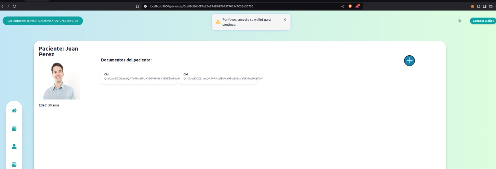
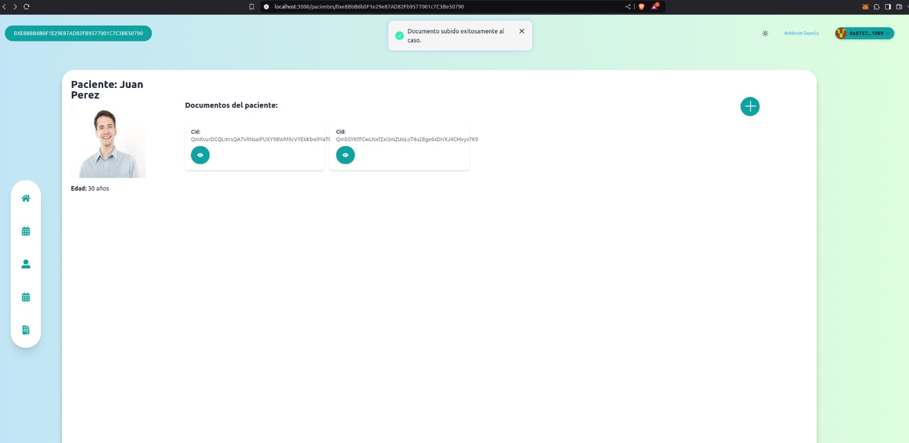

# Medic+

**Medic+** es una solución descentralizada diseñada para transformar la gestión y el control de los historiales médicos personales. Basada en tecnología blockchain, garantiza la privacidad y seguridad de los datos, otorgando a los pacientes el control total sobre quién puede acceder a su información y en qué momento.

Con **Medic+**, compartir datos médicos de forma cómoda y segura se convierte en una realidad, permitiendo a los pacientes acceder a todas las posibilidades que ofrece la telemedicina y la prevención avanzada. Esto incluye la facilidad de obtener segundas opiniones o realizar estudios preventivos con cualquier clínica o especialista, tanto de manera presencial como online.

Además, **Medic+** integra un innovador asistente de inteligencia artificial capaz de traducir diagnósticos médicos en términos claros y comprensibles. Este asistente también sugiere estudios adicionales o cambios en los hábitos de vida basados en normativas internacionales, como las guías de la Organización Mundial de la Salud (OMS). Todo esto se realiza con un enfoque en la privacidad del usuario y un análisis avanzado de sus datos médicos.

**Medic+** no solo empodera a los pacientes, sino que también establece un nuevo estándar en la gestión de información médica al combinar seguridad, accesibilidad e innovación tecnológica.

### Tecnologías Utilizadas

Este proyecto utiliza las siguientes tecnologías:
- 🏗 **Scaffold-ETH 2**: Plantilla de proyecto que nos permite crear aplicaciones web3 escalables y seguras de forma rápida y sencilla.
- **TypeScript**: Lenguaje de programación fuertemente tipado y compilado que nos permite escribir código más seguro y escalable.
- **Next.js**: Framework de React que nos permite crear aplicaciones web escalables y de alta performance.
- **React**: Biblioteca de JavaScript para construir interfaces de usuario.
- **Tailwind CSS**: Framework de CSS que nos permite escribir estilos personalizados de forma rápida y sencilla.
- **Ethers.js**: Biblioteca de JavaScript que nos permite interactuar con la blockchain de Ethereum.
- **Wagmi**: Biblioteca de React que nos permite interactuar con la blockchain de Ethereum de forma sencilla y escalable.

### Algunas pantallas del proyecto
- **Usuario sin accesos mientras no conecte su wallet**: 


- **Usuario sin accesos mientras no conecte su wallet**: 


- **Visualización de informe medico**: 
.jpeg)

### Cómo Contribuir

A continuación, te indicamos cómo puedes colaborar clonando el repositorio y apoyando con código.

#### Clonar el Repositorio

Para clonar el repositorio, ejecuta el siguiente comando en tu terminal:

```bash
git clone https://github.com/EducatEth-Medic/MedicPlus-Frontend
cd MedicPlus-Frontend
```

#### Configuración del Entorno

Antes de ejecutar el proyecto, asegúrate de tener las siguientes herramientas instaladas en tu entorno:

- Node.js (versión 14 o superior)
- Yarn (opcional, pero recomendado)

Instala las dependencias del proyecto con el siguiente comando:

```bash
yarn install
```

#### Ejecutar el Proyecto

Para ejecutar el proyecto en modo de desarrollo, utiliza el siguiente comando:

```bash
yarn start
```

Esto iniciará un servidor local en `http://localhost:3000` donde podrás ver el proyecto en funcionamiento.

#### Propuestas de Cambio

1. **Fork** el repositorio y crea una nueva rama para tu funcionalidad o corrección de errores.
2. Realiza tus cambios y asegúrate de que el proyecto siga funcionando correctamente.
3. Haz un **commit** de tus cambios y empuja la rama a tu repositorio.
4. Envía un **pull request** al repositorio principal describiendo los cambios realizados.

#### Buenas Prácticas

- Asegúrate de que el código sigue el estilo y las convenciones del proyecto.
- Escribe pruebas para tus cambios si es aplicable.
- Intenta mantener tus cambios enfocados y bien documentados.
